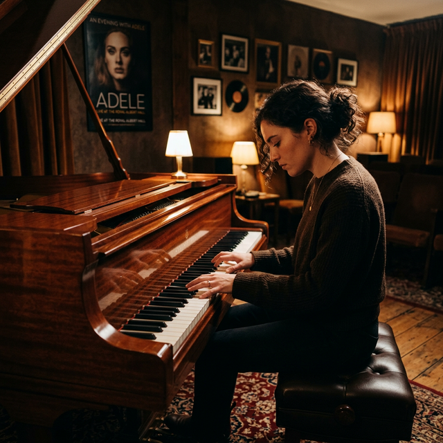

Still, I find it quite mysterious how a two-hour show could have such a profound impact on my life and emotions. For nearly 10 years, I’ve dreamed of attending one of Adele’s concerts, and now, having finally achieved that dream, I feel a deep sense of accomplishment. It wasn’t easy—traveling freely as a Sudanese citizen is challenging, and for a long time, I couldn’t afford it.

But it’s not just about her beautiful face, remarkable voice, or meaningful lyrics. For me, it goes much deeper. When you love something and continue to engage with it day after day, it becomes a part of your life, intertwined with all your memories—the good and the bad. Because of Adele, I fell in love with playing and singing songs, which is one of my main hobbies. Because of her, I’ve learned to appreciate the little things and take a moment to pause and listen. When I feel stressed, I sit at my piano and play “Someone Like You.” She reminds me to stay humble, generous, and empathetic, no matter how my ego might try to take over. She inspires me to follow my passion and make sacrifices, no matter how difficult it may be. Adele has taught me to approach life with laughter and spontaneity, and most importantly, she showed me how to love.

So thank you, @adele, for all the joy you bring to my life.
