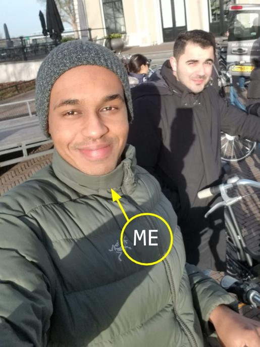

Hi!

My name is Mohamed, I'm a 28 years old guy from Sudan. I lived there for a few years until my family moved to Qatar when I was six years old. I lived most of my life in this rich but culturally conservative place. Somehow, I didn't feel that I'm fully integrated with the society. My family always travels back home in each vacation so I developed more connections with my hometown Sudan rather than the place I lived in. I also decided to study my bachelor there, which was in Civil Engineering. At that time, I didn't know what to study, I just followed what is common there (being a doctor or an engineer). I knew that I love computers and programming but I didn't have the courage to pursue a career in that. However, I'm glad that destiny steered me into a career that I really like and passionate about.

After finishing my bachelor's in Sudan and working for a few years in Qatar designing High-Rise buildings, I decided to take a new challenge and travel to Europe to do my Master's, which lead me to study in Eindhoven University in the Netherlands. Actually, the main reason behind my trip was not to study, I wanted to explore the world and live in a different environment. Now, I'm working in the Netherlands as an engineer and I have a full list of things and projects that I want to try which I will definitely share some of them here in this blog. stay tuned!

