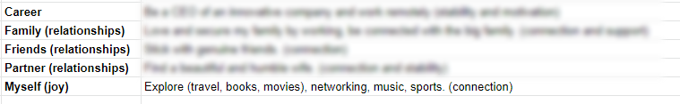

I believe that the principles of running a business are not about making money, they are rather principles that help you reach your goals. Here are a few ideas that I borrow from the business world to pursue my life goals.

##### Vision & Goals
As any company has a vision oneself should have. For me, it is oriented around career, relationships, and myself. These are my long-term goals. 

##### Money & Time
The short-term goals are inspired by the long-term ones and I set them at the beginning of each year with their budget and time as shown. If I don't do that they will be just something to dream about.

##### Productivity
Defining a budget and time is not enough. They should be further divided into small achieveable tasks.

##### Error-log
I’ve realized how fruitful the error log is in making a healthy company. So I have a sheet where I log my mistakes and achievements. This gives me a sense of the time I’m spending.

##### Marketing
A personal blog is a great tool to market yourself. It gives you the windows to express your interests and showcase your projects. My email me@mohamedadil always refer to this blog (marketing at no cost 😉)

At last, you don't have to make money to be a successful entrepreneur.